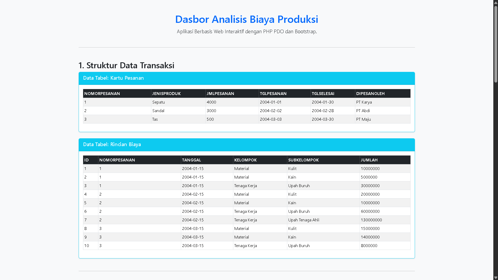
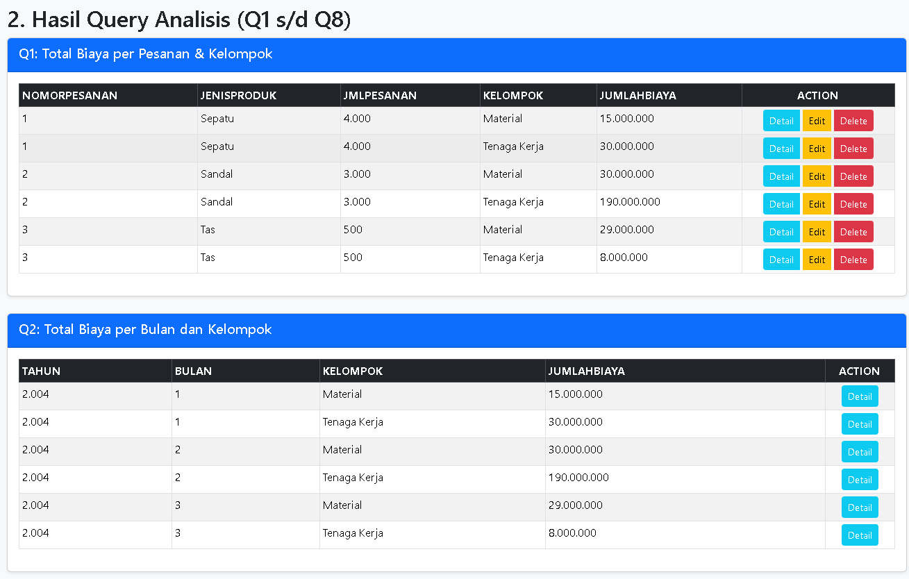
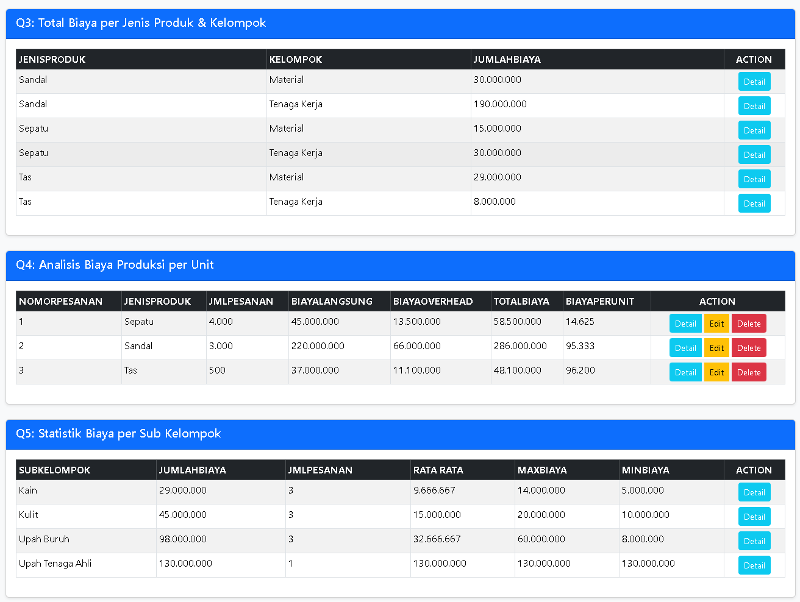
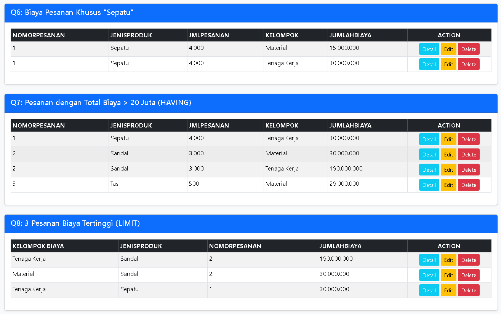
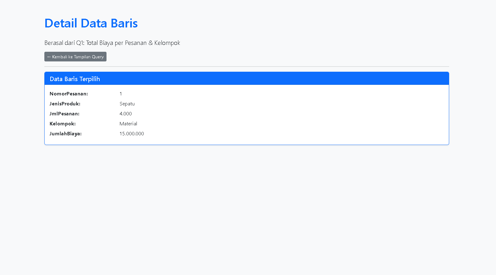
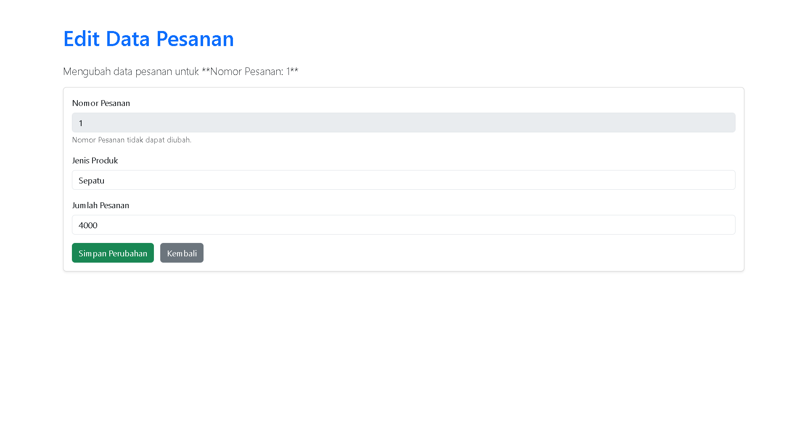

# QUERY BIAYA

### Analisis Data Biaya (PHP PDO & Bootstrap)

Proyek web sederhana ini dibuat untuk menganalisis data transaksi (KartuPesanan & RincianBiaya) melalui 8 *query* SQL yang kompleks. Dibangun menggunakan PHP PDO untuk koneksi aman dan Bootstrap 5 untuk tampilan.

---

## 🚀 FITUR INTI

-   **8 Query Analisis:** Menampilkan hasil agregasi biaya, kalkulasi per unit, dan filter data (Q1-Q8).
-   **Tampilan Data Awal:** Menunjukkan isi dari tabel utama (`KartuPesanan`, `RincianBiaya`) sebagai konteks.
-   **Aksi Dinamis:** Tombol **Detail** (universal) dan **Edit/Delete** (hanya aktif pada data transaksional).

---

## 📸 SCREENSHOT

---
## ❓ Mengapa Q2, Q3, dan Q5 TIDAK BOLEH Memiliki Tombol Edit/Delete?
### Q2 - Total Biaya per Bulan
Jika Anda mengklik **Edit**, data apa yang akan diubah?  
Anda tidak bisa mengedit **total biaya** untuk bulan tertentu secara langsung.  
Untuk mengubahnya, Anda harus mengedit **transaksi asli** yang membentuk total biaya tersebut.

---
### Q3 - Total Biaya per Jenis Produk
Sama seperti Q2, Anda tidak bisa mengedit total biaya untuk **Jenis Produk** secara keseluruhan.  
Perubahan hanya bisa dilakukan pada **data transaksi** yang menjadi dasar perhitungan.

---

### Q5 - Statistik Biaya
Q5 menampilkan perhitungan berupa:  
- **Rata-rata**  
- **Minimum**  
- **Maksimum**  

Karena ini murni hasil **perhitungan otomatis**, maka data ini **tidak dapat diedit** secara manual.

---
### JADI 
Tombol Edit dan Delete hanya muncul pada query transaksional `(Q1, Q4, Q6, Q7, Q8)` karena query tersebut menyajikan data yang dapat dihubungkan kembali ke satu baris di tabel `KartuPesanan` menggunakan kunci unik `NomorPesanan`.

## ⚙️ CARA JALANIN (XAMPP)

1.  **Clone Repo:** Tarik proyek ini ke folder `htdocs` Anda.
2.  **Setup DB:** Buat database, lalu buat tabel `KartuPesanan` dan `RincianBiaya` di phpMyAdmin (pastikan sudah ada datanya). Atau Anda bisa import file `.sql` yang dilampirkan di proyek ini.
3.  **Cek Koneksi:** Pastikan `koneksi.php` sudah disesuaikan dengan nama database dan kredensial XAMPP Anda.
4.  **Akses:** Buka `http://localhost/[FOLDER_ANDA]/tampilan.php`

---

